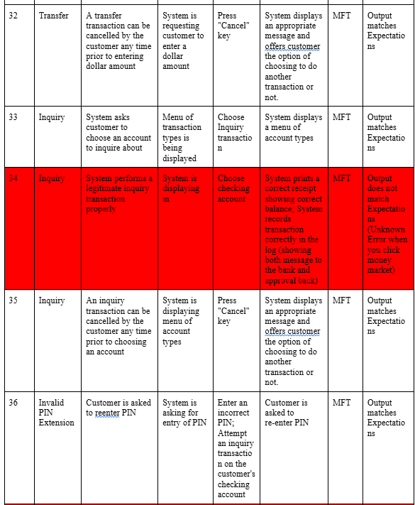

>   **SENG 438 - Software Testing, Reliability, and Quality**

**Lab. Report \#1 – Introduction to Testing and Defect Tracking**

| Group: Group Number  20    |
|-----------------|
| Student 1 name:       Monil Patel(30172624)         |   
| Student 2 name:       Siddhartha Paudel(30172632)   |   
| Student 3 name:       Arsalan Baig(30176639)       |   
| Student 4 name:       Saim Khalid         |   

**Table of Contents**

(When you finish writing, update the following list using right click, then
“Update Field”)

[1 Introduction	1](#_Toc439194677)

[2 High-level description of the exploratory testing plan	1](#_Toc439194678)

[3 Comparison of exploratory and manual functional testing	1](#_Toc439194679)

[4 Notes and discussion of the peer reviews of defect reports	1](#_Toc439194680)

[5 How the pair testing was managed and team work/effort was
divided	1](#_Toc439194681)

[6 Difficulties encountered, challenges overcome, and lessons
learned	1](#_Toc439194682)

[7 Comments/feedback on the lab and lab document itself	1](#_Toc439194683)

# Introduction

This laboratory experiment built upon our understanding that exploratory testing involves the idea of testing features within an application or program without rigorously adhering to predefined test cases, enabling the tester to use expertise and intuition to find unforeseen problems. On the other hand, manual functional testing usually focuses on confirming the particular functionalities of a program or application and confirms the expected behaviour of each known feature based upon a more systematic approach. The purpose of this lab is to understand how useful exploratory testing can be for systems that are new or only partially understood because it allows testers to probe areas they believe might fail, swiftly revealing hidden issues. Concurrently, conducting manual functional tests offered a more systematic way to verify that every known feature behaved as expected.  

# High-level description of the exploratory testing plan

Our exploratory testing strategy focused on verifying an application that was not yet fully known and systematically exploring the program so that we could find the bugs present within it. Before conducting our exploratory testing with a variety of inputs, including situations like decimal inputs and out-of-range numbers, we first chose a few essential functionalities, such deposit, withdrawal, and account balance checks. We were particularly aware of unusual actions during this procedure, such as the system collecting a fixed cost rather than a percentage. When we came across peculiarities or faults within the design of the application, this method enabled us to quickly note down the bugs. We made sure that every bug we found was promptly noted down within our table with justification on why we believed the program had a bug within it.

# Comparison of exploratory and manual functional testing

Exploratory testing is more impromptu and flexible when working with a new or developing system because it mostly depends on the tester's intuition and expertise. As soon as they observe anomalies, testers can swiftly shift their focus to other areas of concern, increasing the likelihood of finding important problems early. In contrast, manual functional testing ensures comprehensive coverage of known requirements by adhering to a set of predetermined processes or test scripts, but it provides less flexibility. While manual functional testing confirmed that each feature operated (or did not) in accordance with its intended behavior, exploratory testing in our lab exposed minor issues, such as the inconsistency where inputting "5 dollars" resulted in a 10-dollar charge. We obtained thorough coverage by combining the two approaches; one was innovative, while the other was strategic and reliable. 

-   Note that you need to submit a report generated by your defect tracking
    system, containing all defects recorded in the system.

# Notes and discussion of the peer reviews of defect reports

We carried out peer evaluations after recording flaws within the application, where team members checked each other's reports for accuracy, completeness, and clarity. We primarily looked at whether certain features of the program were indeed "bugs" or whether the application's design calling for a fixed fee rather than a percentage deduction was the subject of one intriguing argument. Our reporting language was standardized, ambiguities were cleared out, and we had uniform standards for classifying problems thanks to the peer review process. Each bug report became more specific and useful to developers as a result of this reciprocal feedback cycle.

# How the pair testing was managed and team work/effort was divided 

We scheduled online sessions at times that fit everyone’s availability, using a voice call and screen-sharing so that each member could follow along. Typically, one person would run the application and share their screen while the others actively observed, took notes, and suggested different test inputs. If we encountered questionable behavior like the system automatically charging ten dollars when we deposited 5 dollars within our account everyone would weigh in, and we used a simple vote to decide if it should be marked as a confirmed bug or flagged for further investigation. For example, in this case we were unsure if the developer intended for there to be a fixed cost of 10 dollars deducted each time a deposit was made or if he wanted a percentage deduction each time money was inputted within the system. For the debate of fixed cost deduction or bug within the system, votes tied, we labeled the issue in yellow, indicating uncertainty, and returned to it for more discussion later. This collaborative format ensured that everyone gained hands-on familiarity with the tests and that no single person’s bias or oversight dominated the findings.

# Difficulties encountered, challenges overcome, and lessons learned

Determining whether behaviors were actual flaws or intended features was a significant challenge, especially in light of the fees associated with deposits and withdrawals. Through group discussion, we came to understand how crucial it is to have precise, documented requirements and specifications in order to prevent ambiguity. Keeping consistent records while several people were testing at once presented another difficulty, which we overcame by utilizing a well-defined bug report template and a shared online document. Additionally, we discovered that although exploratory testing is less methodical, it frequently identifies about 60% of the amount of errors scripted testing identifies in a fraction of the time. All things considered, the key lesson is that both structured and unstructured methods are essential for identifying potential flaws in a system.

# Comments/feedback on the lab and lab document itself

We found the lab report extremely useful as it provided a practical learning opportunity to successfully enforce the idea of testing concepts. The guidelines offered a precise method on how to conduct exploratory and functional testing by hand. We as a group learned a lot about exploratory, manual, and regression testing from it. 
